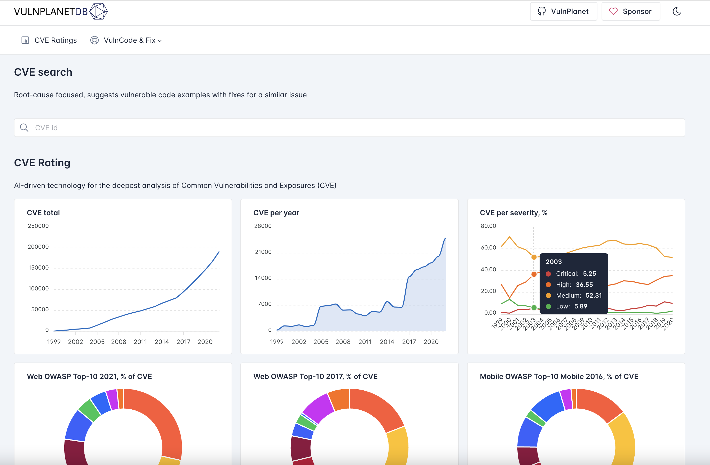

In ***[VulnPlanetDB](https://vulnplanet.com/pages/vulnplanet.html)*** you can search for CVE and next to the standard description information get a similar root-cause vulnerable code example with a fix. This could help you understand the code root cause of the vulnerability much faster and perform research for new CVEs with limited descriptions.

We are using AI-driven technology for the deepest analysis of Common Vulnerabilities and Exposures (CVE). Our model categorized all known CVEs by category, root case, and all common OWASP Top-10 ratings. Explore it at [https://vulnplanet.com/](https://vulnplanet.com/pages/vulnplanet.html)



Curious about Secure Coding? Find vulnerable code snippets with fixes in [VulnPlanet open source codebase](https://github.com/yevh/VulnPlanet)

***Donations***

- USDT TRC20: ```TUwDc2PVag8NsqrTyHNgPvqjNL8fvrbTzV```
- ETH ERC20: ```0x3a7b09b56dd88d4ae491c5cebb63647836304678```
- BTC: ```19hwZ4Jxs1jpQi6tTwYvfYJgyNPWyEFHy8```

***Contact***

- yevhsec1@gmail.com
- ttahabatt@gmail.com
